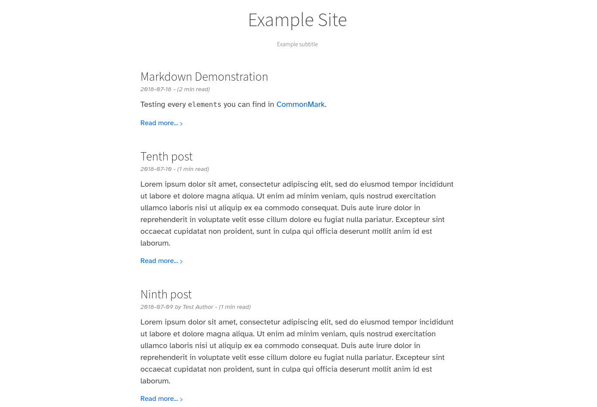

# zola-silk

Silk is a clean, responsive blog theme for [Zola](https://www.getzola.org/)



## Installation

First download this theme to your `themes` directory:

```bash
$ cd themes
$ git clone https://github.com/DenysVuika/zola-silk.git
```

and then enable it in your `config.toml`:

```toml
theme = "zola-silk"
```

The theme requires putting the posts in the root of the `content` folder and to enable pagination,
for example in `content/_index.md`.

```
+++
paginate_by = 5
sort_by = "date"
insert_anchor_links = "right"
+++
```

## Reference guides

## Configuration Options

```toml
[extra]
# A line to display underneath the main title
subtitle = "Example subtitle"

# Text to display in the footer of the page
copyright = "Copyright authors year"

# Your Google Analytics ID
analytics = ""

# See below
katex_enable = false

# See below
instantpage_enable = false
```

A full example configuration is included in config.toml.

Note how pickles also expects `title` and `description` to also be set in the Zola configuration.

### KaTeX math formula support

This theme contains math formula support using [KaTeX](https://katex.org/), which can be enabled by setting `katex_enable = true` in the `extra` section of `config.toml`.

After enabling this extension, the `katex` short code can be used in documents:
* `\KaTeX` to typeset a block of math formulas,
  similar to `$$...$$` in LaTeX

### Figure Shortcode

The figure shortcode is convenient for captioning figures.

```

Your caption here.

```

### Table Shortcode

The table shortcode is convenient for making mobile-friendly tables (centered with overflow scrollbar).

```

| Item         | Price | # In stock |
| :----------- | ----: | ---------: |
| Juicy Apples |  1.99 |        739 |
| Bananas      |  1.89 |          6 |

```

### Fontawesome

This theme includes fontawesome, so that fontawesome icons can be directly used.

### Instant.page

The theme contains instant.page prefetching. This can be enabled by setting `instantpage_enable = true` in the `extra` section of `config.toml`.

## Showing article summaries

By default, the theme will use the first 280 characters of your post as a summary, if a proper [page summary](https://www.getzola.org/documentation/content/page/#summary) using `<!-- more -->` is not provided.
For more sensible summaries, we recommend using the manual more indicator.
